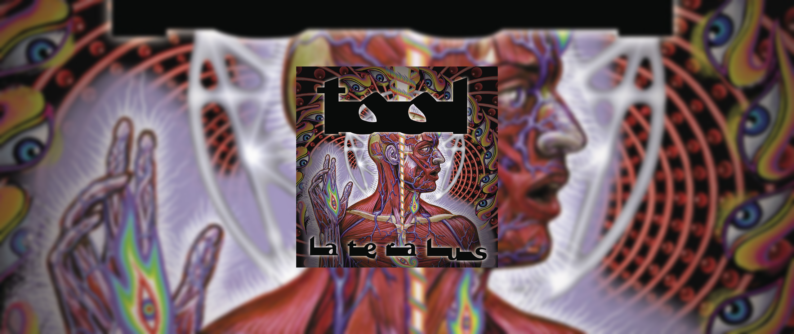
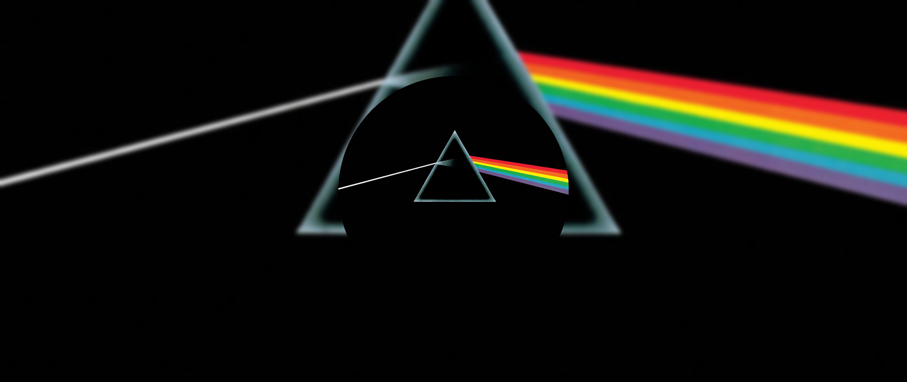
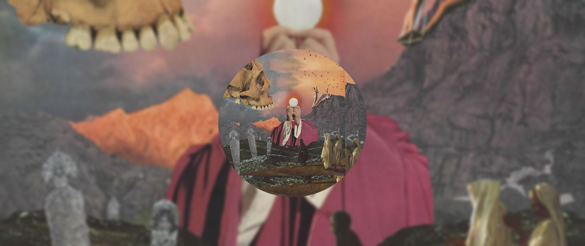

  [](https://pypi.org/project/music_bg/)


<div align="center">

</div>

<p align="center">
  <a href="https://github.com/music-bg/music_bg/wiki">Wiki</a> •
  <a href="#abstract">Abstract</a> •
  <a href="#installation">Installation</a> •
  <a href="#screenshots">Screenshots</a> •
  <a href="#usage">Usage</a>
</p>

<div align="center">
<h1 id="abstract">Abstract</h1>
</div>

This project is a dynamic wallpaper changer.
It waits untill you turn on the music,
downloads album cover if it's possible and
sets it as your wallpapper.

And the main thing, this project is highly customizable.
You can install plugins and write your own configurations.


<div align="center">
<h1 id="installation">Installation</h1>
</div>

⚠️ This project require DBUS to be installed. ⚠️

To install this project simply run:
```bash
pip install music_bg
# Also you can install extra processors
# by running
pip install music_bg_extra
```

<div align="center">
<h1 id="screenshots">Screenshots</h1>
</div>

<div align="center">

</br>

</br>

</div>


<div align="center">
<h1 id="usage">Usage</h1>
</div>

At first you need to generate default config file by runing
```
music_bg gen
```

It will generate config in your home directory with following
contents:
```json
{
  "blender": [],
  "set_command": "feh --bg-fill \"{0}\"",
  "reset_command": "nitrogen --restore",
  "screen_resolution_command": "xrandr | grep '*' | cut -d' ' -f4 | sort --human-numeric-sort --reverse | head -n 1",
  "layers": []
}
```
